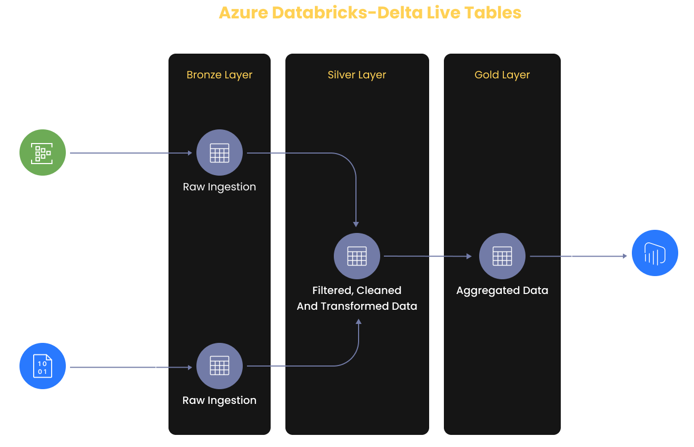

### Project Architecture Diagram:

# What is Delta Live Tables:

> Delta Live Tables are automated way of executing the ETL pipelines by managing all the dependecies between the datasets defines in the pipelines

> Delta live tables automatically captures the dependencies defined in your pipeline and uses this dependency information to determine the execution order when performing an update.

> Delta Live Tables automatically records lineage information in the eveent log for a pipeline.

### Delta Live Tables : Concepts

> Pipelines : The main unit of execution in Delta Live Tables is a pipeline. A pipeline is a directed acyclic graph linking data sources to target datasets.

> Queries : Used to implement data transformations by defining a data source and a target dataset. Delta live tables queries can be impleted in Python or SQL

> Expectations : Implement data quality controls on the contents of a dataset, expectations provide flexibility when processing data that fails data qulity requirement. You can define expectations to retain records that fail validation, drop records that fail validation, or halt the pipeline when a record fails validataion. 

### Multiple Use Cases:

> Useful for both streamingg and batch processing of data in real time
> making decisions in real-time and streaming alerts to the respective system
> Real-time dashboarding whith Power-BI (real-time stock trading analysis and sending alerts)
> Machine learning (risk analysis, prediction trends, and fraud detection etc.)
> Geospatial analytics for driverless vehicles and fleet management
> social Media sentiment analysis.

# Problem Statements:

> Data from various OLTP systems are stored in cloud such as ADLS, S3 and GCS. Some data sets are updated regularly and some are historical snapshots.

> These Kind of data processing generally follow the lakehouse architecture to segment data quality into raw, refined and aggregated layers which is really helpful using DTL pipelines.

> Combine both batch and streaming datasets into single pipeline using Delta Lake concurrent batch and stream operations

## Action Plan and Approach: 

> Airlines data is updated every minute by the team and made available as stream
> Airlines data is also updated by the Airports and made available as batch data once in a day/week
> Solution is to handle these twop types of data generated
> Create reports where metrics to be refreshed every minute for airline data insights
> Plan is to use Azure Databricks delta Live tables along with Azure Event Hubs in this soluition using Python and SQL language.
> Visualization will happen using the Power BI reports